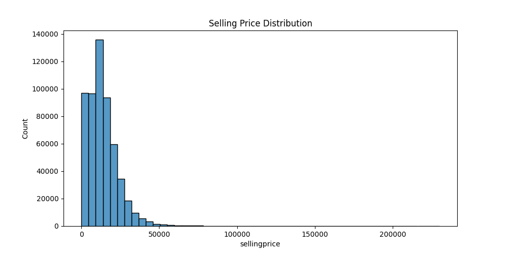
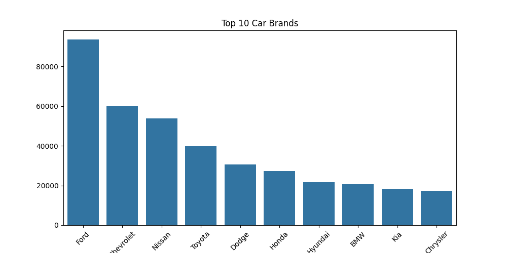

# 🛒 E-Commerce Data Analysis Project

## 📌 Project Overview

This project analyzes a large-scale e-commerce dataset to uncover insights related to pricing, sales trends, and customer behavior. The goal is to perform end-to-end data analysis including data cleaning, exploration, and visualization.

---

## 🎯 Objectives

* Understand sales trends over time
* Analyze price distribution across products
* Identify top-performing brands
* Explore factors affecting product pricing

---

## 🗂️ Project Structure

```
ecommerce-data-analysis/
│
├── data/
│   ├── raw/            # Original dataset
│   └── processed/      # Cleaned dataset
│
├── notebooks/          # Jupyter notebooks (EDA & analysis)
├── src/                # Python scripts (future use)
├── outputs/            # Charts and reports
│
├── README.md
├── requirements.txt
└── .gitignore
```

---

## 🧹 Data Cleaning Steps

* Removed rows with missing target values (`sellingprice`)
* Handled missing categorical values using "Unknown"
* Filled numerical missing values using median
* Fixed invalid date formats and timezone inconsistencies
* Converted `saledate` to datetime format

---

## 📊 Key Insights (To Be Expanded)

Vehicles with higher mileage show a clear drop in resale value
Automatic cars tend to have higher selling prices
Brand X dominates market volume but not pricing
Peak sales observed in month X

---

## 📈 Visualizations

### Price Distribution


### Top Brands


---

## 🛠️ Tools & Technologies

* Python
* Pandas, NumPy
* Matplotlib, Seaborn
* Jupyter Notebook
* Git & GitHub

---

## ❓ Business Questions Answered

- What factors affect car selling price?
- Which brands dominate the market?
- Does mileage impact resale value?
- Are automatic cars priced higher than manual?

---

## 🔍 Advanced Analysis

- Created new feature: car_age
- Identified strong relationship between car age and price
- Removed extreme outliers for better analysis
- Used correlation heatmap to identify key influencing factors

---

## 📌 Conclusion

This analysis shows that vehicle pricing is strongly influenced by mileage, brand, and transmission type. High-mileage vehicles tend to depreciate significantly, while automatic vehicles and premium brands retain higher resale value.

---

## 🚀 How to Run This Project

```bash
git clone https://github.com/dheerajsaini11/ecommerce-data-analysis.git
cd ecommerce-data-analysis
pip install -r requirements.txt
```

---

## 📌 Future Improvements

* Build interactive dashboard (Streamlit / Power BI)
* Add machine learning model for price prediction
* Deploy as web app

---

## 👤 Author

Dheeraj Saini
